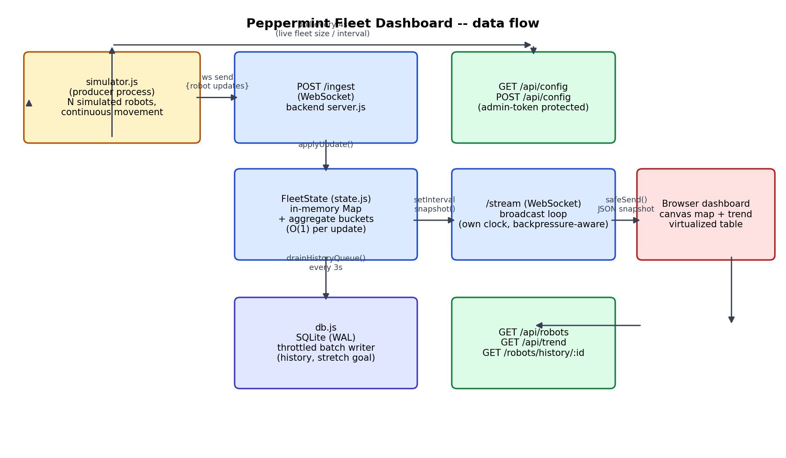

# Architecture

## Components

- **`simulator.js`** — a standalone process, not a library the backend
  imports. Owns a fleet of `SimRobot` instances (continuous position
  interpolation, a small status state machine, battery drain/charge). Every
  `UPDATE_INTERVAL_MS` it batches all robots' current records into one JSON
  array and sends it over its websocket connection to `/ingest`. It also
  polls `GET /api/config` every 4s so fleet size / update interval / payload
  padding can change on a live deployment without a restart.
- **`server.js`** — the backend process. Two websocket servers sharing one
  HTTP server (routed by URL path in the `upgrade` handler): `/ingest` for
  producers, `/stream` for dashboards. Plus a small REST surface
  (`/api/robots`, `/api/trend`, `/api/config`, `/robots/history/:id`,
  `/api/health`) and static file serving for `public/`.
- **`state.js`** — `FleetState`: an in-memory `Map` keyed by `robot_id`, plus
  a ring buffer of aggregate status-count buckets for the trend chart. Every
  method the ingest path calls is O(1); nothing here awaits I/O.
- **`db.js`** — SQLite (via `better-sqlite3`, WAL mode) for the history
  stretch goal. Writes happen in throttled batches from a queue `state.js`
  fills, on a `setInterval` in `server.js`, never on the ingest hot path.
- **`public/`** — static dashboard: canvas map (drawn from the same shelf
  rectangles the simulator avoids), a stacked-area trend chart, a
  virtualized/searchable robot table, and an admin panel for the live
  config knobs.

## Walking one event through the system

1. Inside `simulator.js`, a `SimRobot`'s `tick()` advances its position
   toward its current target, drains or charges its battery, and
   occasionally re-rolls its status.
2. Every `UPDATE_INTERVAL_MS`, `publishTick()` serializes the whole fleet's
   current records to one JSON array and calls `ws.send()` on the
   `/ingest` connection.
3. `server.js`'s `ingestWss` `message` handler parses the array and calls
   `state.applyUpdate(record)` for each robot. `applyUpdate` checks the
   record's `t` against the previously stored value; if it's not newer, the
   message is dropped (see "late/out-of-order updates" below). Otherwise it
   overwrites the `Map` entry and updates the current aggregate bucket.
   Total cost per update: one map write, one object mutation. No I/O.
4. Independently, a `setInterval` in `server.js` fires every
   `BROADCAST_INTERVAL_MS` (default 500ms) and, only if at least one
   dashboard is connected, calls `state.snapshot()` once and sends the
   resulting JSON to every socket in `streamClients` via `safeSend()`.
5. In the browser, `app.js`'s `socket.onmessage` replaces its local `robots`
   map with the new snapshot and calls `render()`, which redraws the canvas
   map, redraws the trend chart, recomputes the filtered/sorted list for the
   virtualized table, and refreshes the detail panel if a robot is selected.
6. A pixel changes: a robot's dot moves on `siteCanvas`, or a segment is
   added to the trend chart's stacked area.

Step 3 and step 4 are deliberately on independent clocks. A robot reporting
every 200ms and a dashboard broadcasting every 500ms never interact directly
— ingestion never blocks waiting on broadcast, and broadcast never blocks
waiting on ingestion.

## When things go wrong

**A robot dies mid-task.** The simulator models this as a transition to
`offline` (occasionally from `active`/`on_mission`) or by dropping its
websocket connection entirely (network flakiness, below). Either way, the
backend keeps serving its last known record, `received_at` stops advancing,
and once `Date.now() - received_at > STALE_AFTER_MS` the dashboard marks it
`stale` (dimmed on the map, greyed in the table) — the operator sees "we
haven't heard from this robot" as a distinct state from "this robot is
fine and idle," which was a deliberate call: silence and idleness are not
the same thing and conflating them would hide real failures.

**Updates arrive late or out of order.** `FleetState.applyUpdate` compares
the incoming record's `t` against the currently stored `t` for that
`robot_id` and drops the message if it isn't newer. This is the one
piece of logic I considered "the trickiest part" and it's covered directly
in `test/state.test.js` (`applyUpdate drops a stale out-of-order message`).
Without this check, a producer that reconnects and replays a buffered
older message could momentarily rewind a robot's displayed position/status
after a newer one had already been shown.

**A robot's connection drops and reconnects.** `simulator.js`'s websocket
client has a `close` handler that retries `connect()` after a fixed delay;
in the meantime, `publishTick()` checks `ws.readyState` before sending and
silently skips ticks it can't deliver rather than queuing them up
unboundedly. On reconnect, normal ticks resume; nothing needs to be
replayed because the backend only cares about current state.

**A dashboard client drops and reconnects.** `app.js` reconnects with
exponential backoff (1s → up to 15s). On every new `/stream` connection,
`server.js` immediately sends a `type: "snapshot"` message with full current
state and recent trend history — a reconnecting client is never left
waiting for the next broadcast tick to become current, and it never needs
to know what it missed while disconnected.

**A dashboard client is slow (bad network, backgrounded tab).** Each socket
in `streamClients` is checked via `ws.bufferedAmount` before every send
(`shouldSendFrame` in `backpressure.js`, unit tested in
`test/backpressure.test.js`); if a client is already backed up past
`MAX_CLIENT_BUFFERED_BYTES`, that one client's frame is skipped for this
tick. This protects every *other* connected dashboard and the broadcast
loop itself from one bad connection — nothing blocks, nothing queues
without bound.

**A burst of ingestion (fleet size or update rate spikes).** Ingestion cost
is O(1) per update with no I/O in the hot path, so a burst just means more
individual, independent `Map.set` calls — there's no shared lock or queue
for them to contend on. The broadcast loop's own cadence means the
dashboard-facing cost of a burst is bounded by `BROADCAST_INTERVAL_MS`
regardless of how bursty ingestion gets.

## What I'd change first if the fleet grew another 10x

At the sizes I actually tested (up to 20,000 robots — see `FINDINGS.md`),
the first thing to give is per-client broadcast bandwidth: every dashboard
tab receives a full JSON snapshot every tick, and that snapshot's size is
linear in fleet size. Another 10x from there (200,000 robots) would make a
~33MB-per-tick payload, which is not viable. The first change I'd make is
converting the broadcast to a diff (only robots whose record changed since
the last tick) plus a periodic full resync, and likely moving off JSON to a
compact binary encoding for position/battery. The second change would be
splitting the single backend process into an ingest tier and a
broadcast/read tier sharing state through something like Redis, so ingest
throughput and dashboard fan-out can scale independently of each other —
right now they share one Node event loop, which was fine at the sizes I
measured but won't be at 10x that.
